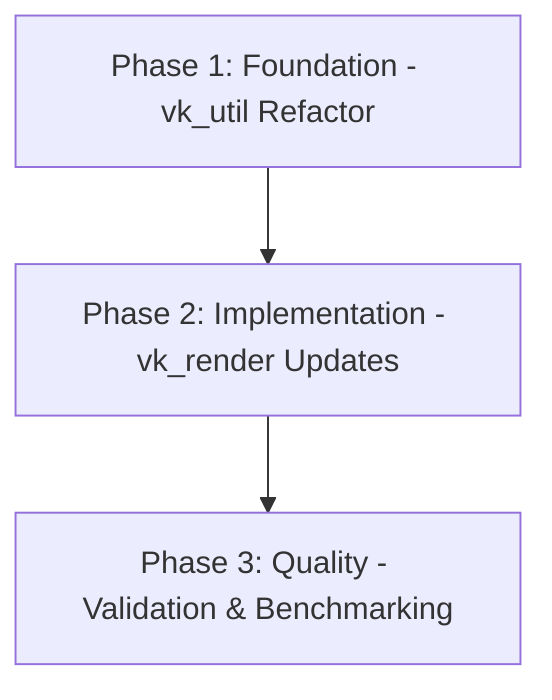

# Implementation Plan: Vulkan ALL_COMMANDS Synchronization Remediation

## 1. Plan Overview

This plan addresses the performance bottlenecks caused by overly broad `ALL_COMMANDS` stage masks in the Vulkan renderer. It involves refactoring the core synchronization utilities and updating their callers with precise, hardware-optimal stage and access masks.

- **Total Phases**: 3
- **Primary Agents**: `refactor`, `coder`, `tester`
- **Target Modules**: `src/renderer/src/vulkan/`

## 2. Dependency Graph

## 3. Execution Strategy

| Phase | Agent | Mode | Parallel | Files Modified |
|-------|-------|------|----------|----------------|
| 1 | `refactor` | Sequential | No | `vk_util.rs` |
| 2 | `coder` | Sequential | No | `vk_render.rs` |
| 3 | `tester` | Sequential | No | (Read-only) |

## 4. Phase Details

### Phase 1: Foundation - `vk_util.rs` Refactor
- **Objective**: Parameterize image transition utilities to support precise synchronization.
- **Agent**: `refactor`
- **Files to Modify**:
    - `src/renderer/src/vulkan/vk_util.rs`:
        - Update `transition_image` to accept `src_stage`, `dst_stage`, `src_access`, and `dst_access`.
        - Update `transition_image_layered` similarly.
- **Implementation Details**:
    - Preserve existing function signatures by creating new "precise" variants or using optional arguments (if idiomatic).
    - Ensure `ALL_COMMANDS` is still available as a fallback but discouraged.
- **Validation**: `cargo check -p renderer`
- **Dependencies**: None

### Phase 2: Implementation - `vk_render.rs` Updates
- **Objective**: Replace broad sync guards with surgical stage masks.
- **Agent**: `coder`
- **Files to Modify**:
    - `src/renderer/src/vulkan/vk_render.rs`:
        - Update `prepare_draw_targets` to use `COLOR_ATTACHMENT_OUTPUT`.
        - Update `copy_draw_to_present` to use `TRANSFER`.
        - Update environment generation passes (IBL/Skybox) with specific `COMPUTE` or `FRAGMENT` stages.
- **Implementation Details**:
    - For each transition, identify the *actual* producer and consumer stages.
    - Reference the Vulkan 1.3/1.4 spec for optimal stage/access pairs.
- **Validation**: `cargo build -p renderer`
- **Dependencies**: Phase 1

### Phase 3: Quality - Validation & Benchmarking
- **Objective**: Verify visual correctness and measure performance improvement.
- **Agent**: `tester`
- **Files to Modify**: None (Read-only)
- **Implementation Details**:
    - Run `demo_pbr`, `demo_model_load`, and `api_test` to confirm visual parity.
    - Use the ImGui timing overlay to compare "GPU pacing noise" against the baseline.
- **Validation**: Full renderer example sweep.
- **Dependencies**: Phase 2

## 5. Cost Estimation

| Phase | Agent | Model | Est. Input | Est. Output | Est. Cost |
|-------|-------|-------|-----------|------------|----------|
| 1 | `refactor` | Pro | 2,500 | 500 | $0.05 |
| 2 | `coder` | Pro | 5,000 | 1,000 | $0.09 |
| 3 | `tester` | Pro | 1,000 | 200 | $0.02 |
| **Total** | | | **8,500** | **1,700** | **$0.16** |

## 6. Execution Profile

- **Total phases**: 3
- **Parallelizable phases**: 0 (Sequential dependency chain)
- **Estimated sequential wall time**: ~15-20 minutes
